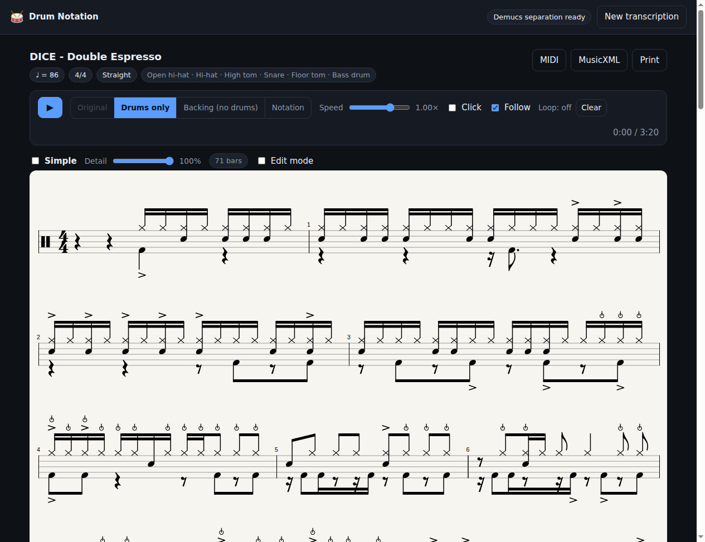

# DrumMate Chart

The DrumMate family's transcriber — paste a YouTube link, get a drum chart you can practise with — plus an isolated
drum track to listen to and a drums-removed backing track to play along to.



## What it does

1. **Fetches** the audio with `yt-dlp` (or takes a file you drop on the page).
2. **Separates the kit** from the mix with Demucs, and renders two MP3s:
   `drums.mp3` (the kit on its own) and `backing.mp3` (everything but the kit).
3. **Finds the pulse** — tempo, beat grid and downbeats. Everything downstream
   works in beat space, so a track that drifts in tempo still lands on a sane grid.
4. **Detects and identifies every hit.** Each drum gets its own detection stream,
   so a kick, snare and hi-hat landing on the same tick all survive.
5. **Quantises** to a musical grid, choosing per bar between straight 8ths/16ths/
   32nds and triplets, and detecting swing.
6. **Engraves** standard drumset notation, and exports MIDI and MusicXML.

## Running it

Needs Python 3.10+ and `ffmpeg`.

```bash
./run.sh            # first run installs everything, then serves on :8000
```

Open <http://127.0.0.1:8000>. The first transcription also downloads the Demucs
model (~80 MB, cached afterwards). A 30-second excerpt takes roughly 20 seconds
on CPU; a full song a few minutes.

## Using it

- **Paste a link** and press Transcribe. Under *Analysis options* you can trim to
  a section, force a tempo or time signature, change the finest note value, and
  adjust detection sensitivity.
- **Four playback sources**: the original video, the isolated drums, the backing
  track without drums, or the notation played back as a synth kit. The score
  follows along bar by bar.
- **Slow it down** with the speed slider, turn on a **click**, and **loop a bar
  range** by clicking a bar (shift-click to set the end).
- **Simple mode** reduces the chart to a plain kick / snare / hi-hat groove on an
  8th-note grid, with no ornaments — the version you learn first.
- **Thin out a busy chart** with the *Detail* slider — it hides the quietest hits
  per drum, which is the quickest cure when a dense mix over-detects. It changes
  what you see and print, not the exported MIDI.
- **Fix mistakes**: turn on *Edit mode*, pick a drum, and click the staff to add
  it — click it again to remove it. The MIDI and MusicXML re-export automatically.
- **Print** the chart, or open the MusicXML in MuseScore for a polished PDF.

## How the drums are told apart

Two kinds of evidence are combined:

- **Partially-fixed NMF.** The spectrogram is decomposed against seeded kick,
  snare and hi-hat templates plus free components that soak up everything else.
  Because the decomposition is additive, overlapping drums separate cleanly —
  this is what makes simultaneous hits work.
- **Band-limited spectral flux**, which is sharper in time than NMF and drives
  the tom and cymbal streams.

Each stream is then gated on measured features: sub-band flux for the kick,
low-mid ring time and pitch for toms (toms ring, the kick does not), and
high-band decay for the cymbals — short is a closed hat, long and loud and
one-off is a crash, long and recurring is a ride. Toms are assigned to
high/mid/floor by clustering their pitches across the whole song, so it adapts
to the kit rather than assuming fixed frequencies.

Accuracy on a synthetic test with known ground truth (`F1`, 117 hits):

| kick | snare | hi-hat | toms | overall |
|------|-------|--------|------|---------|
| 0.93 | 0.90  | 0.94   | 0.67–1.00 | **0.91** |

A second, harder fixture with realistic broadband hi-hats (the kind whose
1.5–7 kHz sizzle overlaps the snare's signature) scores F1 0.89, with snare
precision 1.00. The key ideas, each measured before being trusted:

- **A snare must *arrive***: in a wash of 16th-note hats the 1.5–6 kHz band
  never goes quiet, so a hat stroke barely rises above its own background —
  but a snare's wire burst still jumps an order of magnitude, together with a
  shell-band (200–500 Hz) rise the hats cannot produce.
- **A kick must arrive in the low band** — a jump relative to a moment earlier,
  so neither a bright transient nor the previous kick's decaying tail counts.
- **Open vs closed hi-hat is a trough test**: a closed hat always leaves a
  trough in the high band before the next stroke refills it; an open hat or
  crash rings straight through. This needs no decay-time measurement, which
  dense playing censors.

On top of detection, a conservative engraving cleanup keeps the chart looking
like a chart: a lone one-slot hole inside an otherwise continuous cymbal run is
repaired (a drummer does not skip one 16th mid-run; genuinely sparse patterns
are never touched), flams require two solid strokes rather than detection
jitter, rests are always spelled undotted, and dense bars are given
proportionally more width. The *Detail* view defaults to 90%%, hiding only the
weakest tail of detections; 100%% is one nudge away.

Cymbal *type* beyond that (ride vs crash) remains the least certain call, and
automatic transcription of a dense mix is still a strong starting point rather
than a finished chart — hence *Simple*, *Detail* and *Edit mode*.

## Notation conventions

Standard drumset notation on a 5-line staff with a percussion clef. Stems up for
the hands, stems down for the feet. Cymbals use `x` noteheads; accents are `>`,
open hi-hats are `o`, ghost snare notes are in parentheses.

```
 A5  ---  crash            C5  ---  snare
 G5  ---  hi-hat           A4  ---  floor tom
 F5  ===  ride             F4  ---  bass drum
 E5  ---  high tom         D4  ---  hi-hat foot
 D5  ===  mid tom
```

## Layout

```
backend/
  server.py              FastAPI: jobs, files, health, re-export
  pipeline/
    fetch.py             yt-dlp download → normalised 44.1 kHz wav
    separate.py          Demucs drum stem + drums.mp3 / backing.mp3
    rhythm.py            tempo, beat grid, downbeats
    onsets.py            NMF + flux detection and classification
    quantize.py          snap to grid, pick subdivision, detect swing
    score.py             hits → voices, durations, rests, tuplets
    exports.py           MIDI and MusicXML writers
    rebuild.py           re-engrave after browser edits
    drums.py             the kit map (staff position, notehead, GM note)
frontend/
  index.html, style.css
  app.js                 layout engine, VexFlow rendering, playback, editing
  vendor/vexflow.js      MIT, bundled
```

The browser re-runs the same beat-by-beat layout the exporter uses, so edits
re-engrave instantly without a round trip to the server.

## Configuration

| variable | meaning |
|---|---|
| `DRUMS_MAX_SECONDS` | cap on analysed audio length (default 600) |
| `DRUMS_YT_CLIENTS` | yt-dlp player clients to try, in order |
| `DRUMS_COOKIES_FROM_BROWSER` | e.g. `chrome`, for age-restricted videos |
| `DRUMS_COOKIE_FILE` | path to a `cookies.txt` export |
| `DRUMS_DATA` | where jobs and caches are written |

If YouTube starts refusing downloads, `DRUMS_YT_CLIENTS` is the first knob to
turn; which clients work changes over time.

## Notes

Transcriptions are for private practice. Respect the rights of the material you
run through it, and whatever terms apply to the site you fetch from.
